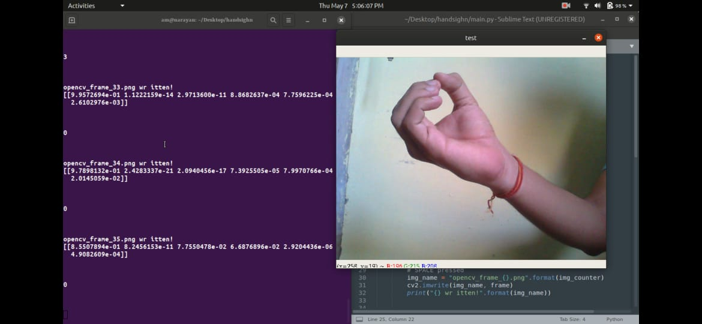
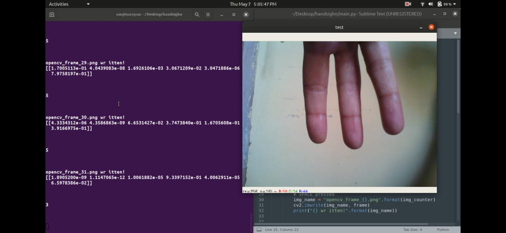

# HandSigns

<h3><I>A Classifier that implemnts Convolutional Neural Networks (CNNs) to count the number of fingers
Trained using SIGNS dataset is a collection of 6 signs representing numbers from 0 to 5.</I></h3>

Download dataset from here:
https://github.com/shivanshuman021/HandSigns-Indentifier/tree/master/datasets

<h2>Network Architecture</h2>

<h3>Convolution Operation : A Review</h3>

  <h3><B>Dependencies</B></h3>
<h4> Python 3 </h4>
    <h4><I> TensorFlow 2.2.1</I></h4>  <I>https://www.tensorflow.org/install </I>
    <h4><I> Keras </I></h4>
  <h4><I> OpenCV<I></h4> </I>https://pypi.org/project/opencv-python/</I>
    

<video width="620" height="440" src="images/test.mp4" type="video/mp4" controls>
</video>

 . 
 . 
 . 
 . 

<h3><B>

  

    
  

  

    
  

  

 .
 
 .
 
 .
 
 .
 

<h2>TesT Yourself</h2>

&#128540;

  

